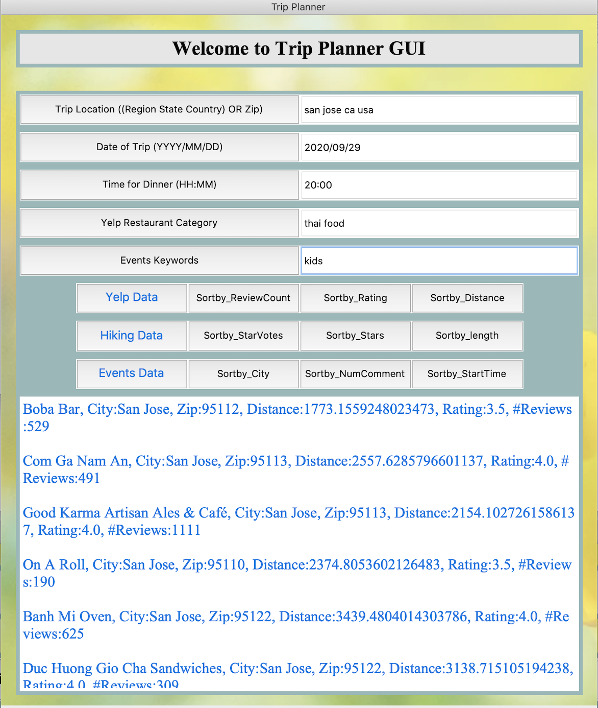

# Trip Planner
(Developed for MIDS W200 Python project I in summer 2020 by Ratan Deep Singh ratan_singh@berkeley.edu)

I remember the difficulty in planning any trip during the weekends – browsing through multiple websites to get the data for perfect hiking spots, for different events happening around the area and also the best restaurant to provide your favorite cuisine for the dinner. For me personally, this has been a very time consuming process involving multiple hours to browse through various websites and finalizing the trip details. Hence, I came up with an idea to help users bring in all the information at one single place – give the flexibility to users the pick their criteria for various trip activities, dinner and etc. and provide all the data in one single place (GUI or website).

Thus started the adventure of **Trip Planner** GUI which later became tripinfoapp.com. This project pulls in the data from APIs provided by 3 different websites below:

1) yelp.com -> Used for getting information on restaurants for dinning
2) hikingproject.com -> Used for getting information of hiking trails in the area
3) eventful.com -> Used for getting information on events happening in the area

The tripinfoapp.com website has the API key info built in through the environment but for running the GUI, the user must have API keys from all the 3 websites above. Below are some useful tips on getting API keys from these websites: 

  - **Yelp API key:** Below video provides a hands-on tutorial on how to request API key for Yelp\
     -> https://www.youtube.com/watch?v=GFhGN36Wf7Q
  - **Hikingproject API key:** Signup on below website using your email ID:\
     -> https://www.hikingproject.com/data
  - **Eventful API:** https://api.eventful.com/keys  
     -> Register your account at : http://www.eventful.com/join?goto=http%3A%2F%2Fapi.eventful.com%2Fkeys  
     -> After above, request an API key here in link below: http://api.eventful.com/keys/new (Fill in some dummy information here to get the API key)

### Instructions for running the GUI 

#### I) Load the GUI: 
% python tkint.py  
% Enter API key for yelp.com **YELP_API_KEY**  
% Enter API key for hikingproject.com **HIKINGPROJECT_API_KEY**  
% Enter API key for eventful.com **EVENTFUL_API_KEY**  
% Loading the GUI for Trip Planner  

#### II) Enter the relevant arguments in each of the boxes in correct format
  - **Trip Location:** Enter either (Region State Country) OR Zip Code
  - **Date of the Trip:** Use format (YYYY/MM/DD)
  - **Time for Dinner:** Use format (HH:MM) on 24 hour scale. So if you plan to have dinner at 08:00 PM, enter "20:00"
  - **Yelp Restaurant Category:** Enter Dinner Cuisine here. Eg. "Thai Food" 
  - **Event Keywords:** Type of events you are interested in. Eg. "Kids", "music", "dance"
  - Please make sure to hit all the above buttons after entering the arguments. This make sure that the GUI picks up any changes in arguments correctly. 

#### III) Click on either of the buttons "Yelp Data", "Hiking Data" or "Events Data" 
  - Each of these datas could be sorted with respect to review count, rating and etc (by clicking the "Sortby_ReviewCount", "Sortby_Rating" and etc)  

